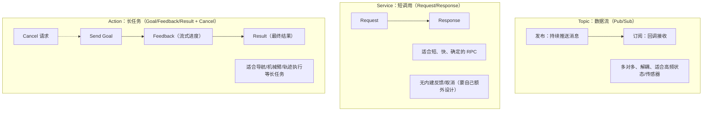

下面给你一套 **可直接照抄执行** 的 Day 3（ROS2 Action）流程：从“概念讲清楚”到“跑 Fibonacci 示例 + CLI 发 goal/看 feedback/拿 result/取消”，最后把 `notes/day3_actions.md` 写出来，并附一张你自己画的 **topic vs service vs action 对比图**（我用 Mermaid 画，你可以直接放进 md）。

> 假设你用的是 **Ubuntu 22.04 + ROS2 Humble**（你前面 Day0/Day1/Day2 的路径也基本是这个组合）。
> 如果你是 Jazzy（24.04）也差不多，只是包名可能不同。

---

## 0）先把“你必须能讲出来的点”讲透（面试/口头表达版）

### Action 的三个核心元素：goal / feedback / result

* **goal**：你给机器人下达的“任务目标/参数”。比如：Fibonacci 的 `order=10`；导航的目标点 `(x,y,theta)`；机械臂抓取的目标姿态。
* **feedback**：任务执行过程中的**进度/中间状态**，会不断流式返回。比如：当前 Fibonacci 序列已经算到 `[0,1,1,2,3]`；导航当前距离目标还有 2.3m；机械臂当前抓取阶段到 “approach / grasp / lift” 哪一步。
* **result**：任务最终完成（成功/失败/被取消）后返回的**最终结果**。比如：完整 Fibonacci 序列；导航是否到达、耗时；抓取是否成功、失败原因等。

### cancel（取消）是 Action 的一等公民

* Action 的设计就是为“长任务”服务，所以必须支持：

  * **客户端发起 cancel**
  * 服务端在执行中 **响应 cancel 请求**、停止执行、返回 canceled 状态/结果（可能是部分结果或空结果）

### 为什么 Action 不等于 Service（最容易混淆点）

* **Service**：一次请求一次响应，适合“短、快、确定”的 RPC 行为（比如“读一下当前模式”“设置一个参数”“做一次瞬时计算”）。

  * 没有天然的进度反馈（你只能自己再搞 topic 或拆成多次 service）
  * 取消也不自然（请求发出后，服务端要不要停？怎么停？协议层面不帮你）
* **Action**：把“长任务执行模型”打包成标准协议：**goal + feedback + result + cancel**。

  * 机器人领域大量任务天然是长任务：导航、跟随、机械臂轨迹、建图、对接 Dock、抓放等
  * 如果你用 service 去做这些，你会不断“手搓”进度 topic、取消 topic、状态机，最后你就自己造了一个 action……

一句话总结（你可以背）：
**Action = 为长任务标准化的 RPC：能给进度（feedback），能取消（cancel），最后给结果（result）。Service 更像短调用；Topic 更像广播数据流。**

---

## 1）准备环境（一次性）

先确认 ROS 环境已 source：

```bash
echo $ROS_DISTRO
# 预期输出 humble（或 jazzy）

source /opt/ros/$ROS_DISTRO/setup.bash
```

建议你把它写进 `~/.bashrc`（如果你 Day0 已做过就跳过）：

```bash
grep -n "setup.bash" ~/.bashrc || echo "source /opt/ros/$ROS_DISTRO/setup.bash" >> ~/.bashrc
source ~/.bashrc
```

---

## 2）安装/找到 Fibonacci Action 示例（优先用官方 tutorial 包）

### 2.1 直接 apt 安装（最省事）

```bash
sudo apt update
sudo apt install -y ros-$ROS_DISTRO-action-tutorials-interfaces ros-$ROS_DISTRO-action-tutorials-py
```

验证包是否存在：

```bash
ros2 pkg list | grep action_tutorials
# 预期能看到：
# action_tutorials_interfaces
# action_tutorials_py
```

查看可执行程序：

```bash
ros2 pkg executables action_tutorials_py
```

常见会看到类似：

* `action_tutorials_py fibonacci_action_server`
* `action_tutorials_py fibonacci_action_client`

> 如果你这里没看到这些名字：别慌——不同发行版/打包方式可执行名可能略不同。
> 你只需要记住：我们要启动 **Fibonacci action server**（提供 `/fibonacci` action），然后用 CLI 或 client 发 goal。

---

## 3）跑 Fibonacci Action Server（终端 1）

开一个新终端（终端1）：

```bash
source /opt/ros/$ROS_DISTRO/setup.bash
ros2 run action_tutorials_py fibonacci_action_server
```

你可以先别急着理解 server 代码，先把行为跑通。
此时 server 会创建一个 action 名称（通常就是 `/fibonacci`）。

另开一个终端（终端2）验证 action 列表：

```bash
source /opt/ros/$ROS_DISTRO/setup.bash
ros2 action list
```

你应该能看到类似：

* `/fibonacci`

再看 action 详情（类型、接口）：

```bash
ros2 action info /fibonacci
```

你会看到 action type，通常是：

* `action_tutorials_interfaces/action/Fibonacci`

---

## 4）用 CLI 发 goal + 看 feedback + 拿 result（终端 2）

### 4.1 发送 goal，并实时打印 feedback

在终端2执行：

```bash
ros2 action send_goal /fibonacci action_tutorials_interfaces/action/Fibonacci "{order: 10}" --feedback
```

你会看到类似效果（示意）：

* 先显示 “Goal accepted” + goal id（UUID）
* 然后不断打印 feedback（序列逐步变长）
* 最后打印 result（完整序列）

> 这一步你就已经能讲清楚：
>
> * goal 是 `{order:10}`
> * feedback 是不断增长的 `partial_sequence`
> * result 是最终 `sequence`

### 4.2 “只拿 result，不看 feedback”

```bash
ros2 action send_goal /fibonacci action_tutorials_interfaces/action/Fibonacci "{order: 10}"
```

---

## 5）试一次 cancel（如果示例支持）（终端 2）

Action cancel 有两种常见方式（你都可以试）：

### 5.1 方式 A：取消该 action name 下的所有 goals（简单粗暴）

先发一个更长的目标（让它跑久一点）：

```bash
ros2 action send_goal /fibonacci action_tutorials_interfaces/action/Fibonacci "{order: 50}" --feedback
```

在它还在刷 feedback 的时候，再开 **终端3**，执行：

```bash
source /opt/ros/$ROS_DISTRO/setup.bash
ros2 action cancel /fibonacci
```

你应该能看到 cancel 请求已发送，并且终端2那边会停止继续算，最终以 canceled 状态结束（具体打印格式不同版本略有差异）。

### 5.2 方式 B：按 goal id 精准 cancel（更“标准”）

`send_goal` 输出里通常会打印 goal UUID。你可以复制它，然后：

```bash
ros2 action cancel /fibonacci --goal-id <PASTE_UUID_HERE>
```

> 如果你的 `ros2 action cancel` 不支持 `--goal-id`（有些环境 CLI 参数略不同），那就用 5.1 的“取消全部 goals”即可，足够完成 Day3 任务。

---

## 6）你要交付的输出：`notes/day3_actions.md`

下面这份你可以直接保存成 `notes/day3_actions.md`（照抄即可，之后你再按自己实际运行结果补两三行输出截图/复制粘贴）。

### 6.1 创建文件与目录

在你的 notes repo 里：

```bash
mkdir -p notes
nano notes/day3_actions.md
# 或者用 code 打开：code notes/day3_actions.md
```

### 6.2 直接粘贴这份内容（含对比图）

````md
# Day 3 — ROS2 Action（长任务：goal/feedback/result + cancel）

## 今日目标
掌握 Action 的定位：**长时任务执行模型**，支持：
- goal（目标）
- feedback（进度反馈）
- result（最终结果）
- cancel（可取消）

并能用 CLI 跑经典 Fibonacci 示例：
- 发 goal
- 看 feedback
- 拿 result
- 试 cancel

---

## 概念梳理：为什么 Action ≠ Service

### Action 的三个核心：goal / feedback / result
- **goal**：任务目标/参数（导航目标点、机械臂抓取目标、Fibonacci 的 order）
- **feedback**：执行中的进度/中间状态（持续流式返回）
- **result**：任务结束时的最终结果（成功/失败/取消）

### cancel（取消）
Action 天然支持取消：
- client 可以请求 cancel
- server 在执行中响应 cancel，停止任务并返回 canceled 状态/结果

### 为什么 action 不等于 service
- **Service**：一次请求一次响应，适合短、快、确定的 RPC；没有天然进度反馈，也不天然支持取消
- **Action**：为长任务标准化了协议（goal+feedback+result+cancel），非常符合机器人“任务执行”的形态

一句话总结：
> **Action = 长任务的标准 RPC（可反馈、可取消、最终结果）**  
> Service 更像短调用；Topic 更像广播数据流。

---

## 实战：Fibonacci Action 示例（action_tutorials_py）

### 1. 安装
```bash
sudo apt update
sudo apt install -y ros-$ROS_DISTRO-action-tutorials-interfaces ros-$ROS_DISTRO-action-tutorials-py
````

### 2. 启动 Action Server（终端 1）

```bash
source /opt/ros/$ROS_DISTRO/setup.bash
ros2 run action_tutorials_py fibonacci_action_server
```

### 3. 查看 action 列表与类型（终端 2）

```bash
source /opt/ros/$ROS_DISTRO/setup.bash
ros2 action list
ros2 action info /fibonacci
```

### 4. 发送 goal + 观察 feedback + 获取 result（终端 2）

```bash
ros2 action send_goal /fibonacci action_tutorials_interfaces/action/Fibonacci "{order: 10}" --feedback
```

现象（要点）：

* goal：order=10
* feedback：partial_sequence 会不断增长
* result：最终 sequence 返回完整 Fibonacci 序列

### 5. Cancel（取消）

先发一个更长的任务（让它跑久一点）：

```bash
ros2 action send_goal /fibonacci action_tutorials_interfaces/action/Fibonacci "{order: 50}" --feedback
```

在它还在输出 feedback 时（终端 3）：

```bash
source /opt/ros/$ROS_DISTRO/setup.bash
ros2 action cancel /fibonacci
```

预期现象：

* server 停止计算
* client 结束并显示任务被取消（canceled）

---

## 自己画的对比图：Topic vs Service vs Action（核心差异）



---

## 我能讲出来的版本（口述要点）

* Topic：连续数据流（传感器/状态），发布订阅，多对多，解耦
* Service：一次请求一次响应，短 RPC，没有天然进度反馈，也不天然支持取消
* Action：长任务模型 = goal + feedback + result + cancel；机器人任务执行最常见

```

---

## 7）你可以用这段“自测口述稿”检验是否真的掌握（30 秒）

你对着空气讲一遍：

> “Action 用于长任务。客户端发 goal，执行中不断给 feedback，结束返回 result。Action 还天然支持 cancel。Service 是短调用，一次请求一次响应，不天然提供进度/取消；Topic 是持续数据流广播。导航/机械臂抓取这类都应该用 action，而不是用 service 硬凑。”

如果你这段能顺畅讲出来，Day3 基本稳了。

---

如果你愿意再加分（可选）：把你 Fibonacci 的 **实际终端输出（几行）** 粘到 md 里，作为“我真的跑过”的证据；或者我也可以帮你把 server/client 的 Python 代码结构用“最小心智负担”的方式读一遍，让你知道 action server 到底是怎么发布 feedback、怎么响应 cancel 的。
```
