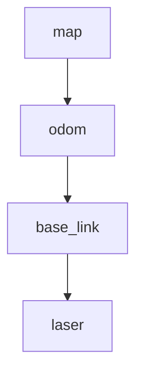

下面给你一套 **可直接照做** 的 Day 6（tf2）流程：从“概念直觉”→“跑起来”→“看 frame tree”→“能讲清 base_link / odom / map”。

我默认你在 **Ubuntu 22.04 + ROS2 Humble**（你前面也在用这个组合）。

---

## 0) 今天你要先建立的直觉（不推导数学）

### 1) frame（坐标系）是什么？

“同一个点/物体”，在不同坐标系里会有不同坐标表示。

* `base_link`：**机器人本体坐标系**（底盘/机身中心附近）
* `laser` / `camera_link`：**传感器坐标系**（相对机身有固定偏移）
* `odom`：**里程计坐标系**（连续、平滑，但会漂移）
* `map`：**地图/世界坐标系**（全局一致，但可能“跳一下”纠正）

### 2) transform（坐标变换）是什么？

一个 transform 表达的是：**child frame 在 parent frame 里的位姿**（平移+旋转）。

> TF2 的核心就是：维护一堆 `parent -> child` 的变换，让你能随时问：
> “A 坐标系里的某个点，换到 B 坐标系里是多少？”

### 3) tree（坐标树）是什么？

所有 frame 之间的关系通常组织成一棵树（更准确是“无环的有向图”，常见用树来组织）：

* 每条边是一条 transform（带时间戳）
* 从任意 frame 到另一个 frame **有且只有一条路径**（避免回环）

### 4) 为什么机器人不能只有“一个世界坐标系”？

因为机器人系统里“世界观”来自不同来源、性质不同：

* **里程计（odom）**：短时间内连续平滑，控制/局部规划很喜欢；但时间长会漂。
* **定位/SLAM（map）**：全局一致；但它为了纠正漂移，可能让 `map->odom` **偶尔跳变**。
* **机身/传感器**：都以 `base_link` 为中心，各自固定安装偏移；你不可能把所有数据都强行变成一个坐标系再发布（太慢、也不稳定）。

---

## 1) 安装今天需要的包

开一个新终端：

```bash
sudo apt update
sudo apt install -y \
  ros-humble-tf2-ros \
  ros-humble-tf2-tools \
  ros-humble-rviz2
```

然后 source：

```bash
source /opt/ros/$ROS_DISTRO/setup.bash
echo $ROS_DISTRO
# 期望输出 humble
```

---

## 2) 建一个 Day6 workspace + package（你自己写 broadcaster/listener）

### 2.1 创建目录结构（建议你按你的 notes repo 风格放）

例如你今天放在 `day-6/ros2_ws`：

```bash
mkdir -p ~/Projects/robotics-onboarding-notes/day-6/ros2_ws/src
cd ~/Projects/robotics-onboarding-notes/day-6/ros2_ws/src
```

### 2.2 创建 Python 包

```bash
ros2 pkg create tf2_demo --build-type ament_python --dependencies rclpy tf2_ros geometry_msgs
```

---

## 3) 写一个动态 tf broadcaster：发布 `odom -> base_link`

编辑文件：

```bash
cd ~/Projects/robotics-onboarding-notes/day-6/ros2_ws
nano src/tf2_demo/tf2_demo/odom_to_base_broadcaster.py
```

粘贴下面代码（一个“绕圈运动”的 base_link）：

```python
#!/usr/bin/env python3
import math

import rclpy
from rclpy.node import Node

from geometry_msgs.msg import TransformStamped
from tf2_ros import TransformBroadcaster


def yaw_to_quat(yaw: float):
    """Convert yaw (Z rotation) to quaternion (x,y,z,w)."""
    half = yaw * 0.5
    return (0.0, 0.0, math.sin(half), math.cos(half))


class OdomToBaseBroadcaster(Node):
    def __init__(self):
        super().__init__("odom_to_base_broadcaster")
        self.br = TransformBroadcaster(self)

        # publish at 20Hz
        self.timer = self.create_timer(0.05, self.on_timer)

        # motion params
        self.radius = 1.0  # meters
        self.omega = 0.5   # rad/s

        self.get_logger().info("Publishing dynamic TF: odom -> base_link")

    def on_timer(self):
        now = self.get_clock().now()
        t = now.nanoseconds * 1e-9

        x = self.radius * math.cos(self.omega * t)
        y = self.radius * math.sin(self.omega * t)
        yaw = self.omega * t  # facing direction changes over time

        tf_msg = TransformStamped()
        tf_msg.header.stamp = now.to_msg()
        tf_msg.header.frame_id = "odom"
        tf_msg.child_frame_id = "base_link"

        tf_msg.transform.translation.x = float(x)
        tf_msg.transform.translation.y = float(y)
        tf_msg.transform.translation.z = 0.0

        qx, qy, qz, qw = yaw_to_quat(yaw)
        tf_msg.transform.rotation.x = qx
        tf_msg.transform.rotation.y = qy
        tf_msg.transform.rotation.z = qz
        tf_msg.transform.rotation.w = qw

        self.br.sendTransform(tf_msg)


def main():
    rclpy.init()
    node = OdomToBaseBroadcaster()
    try:
        rclpy.spin(node)
    except KeyboardInterrupt:
        pass
    node.destroy_node()
    rclpy.shutdown()


if __name__ == "__main__":
    main()
```

给它可执行权限：

```bash
chmod +x src/tf2_demo/tf2_demo/odom_to_base_broadcaster.py
```

---

## 4) 写一个 tf listener：监听并打印 `odom -> base_link`

创建文件：

```bash
nano src/tf2_demo/tf2_demo/tf_listener.py
```

粘贴：

```python
#!/usr/bin/env python3
import math

import rclpy
from rclpy.node import Node

from tf2_ros import Buffer, TransformListener


def quat_to_yaw(qx, qy, qz, qw) -> float:
    """Extract yaw from quaternion assuming Z-up (planar)."""
    # yaw (z-axis rotation)
    siny_cosp = 2.0 * (qw * qz + qx * qy)
    cosy_cosp = 1.0 - 2.0 * (qy * qy + qz * qz)
    return math.atan2(siny_cosp, cosy_cosp)


class SimpleTfListener(Node):
    def __init__(self):
        super().__init__("simple_tf_listener")
        self.buffer = Buffer()
        self.listener = TransformListener(self.buffer, self)

        self.timer = self.create_timer(0.5, self.on_timer)
        self.get_logger().info("Listening TF: odom -> base_link (print pose)")

    def on_timer(self):
        try:
            tf = self.buffer.lookup_transform("odom", "base_link", rclpy.time.Time())
            tx = tf.transform.translation.x
            ty = tf.transform.translation.y
            q = tf.transform.rotation
            yaw = quat_to_yaw(q.x, q.y, q.z, q.w)
            self.get_logger().info(f"base_link in odom: x={tx:.2f}, y={ty:.2f}, yaw={yaw:.2f} rad")
        except Exception as e:
            self.get_logger().warn(f"TF lookup failed: {e}")


def main():
    rclpy.init()
    node = SimpleTfListener()
    try:
        rclpy.spin(node)
    except KeyboardInterrupt:
        pass
    node.destroy_node()
    rclpy.shutdown()


if __name__ == "__main__":
    main()
```

加权限：

```bash
chmod +x src/tf2_demo/tf2_demo/tf_listener.py
```

---

## 5) 注册 console_scripts（让 `ros2 run` 能跑）

编辑 `setup.py`：

```bash
nano src/tf2_demo/setup.py
```

找到 `entry_points={ ... }`，改成这样（保留你原来其它内容即可）：

```python
entry_points={
    'console_scripts': [
        'odom_to_base_broadcaster = tf2_demo.odom_to_base_broadcaster:main',
        'tf_listener = tf2_demo.tf_listener:main',
    ],
},
```

确认 `tf2_demo/tf2_demo/__init__.py` 存在（一般自动有）。

---

## 6) build & source

```bash
cd ~/Projects/robotics-onboarding-notes/day-6/ros2_ws
colcon build --symlink-install
source install/setup.bash
```

---

## 7) 跑起来：broadcaster + listener + 加一条静态传感器 tf

### 7.1 终端 A：跑 broadcaster（动态）

```bash
cd ~/Projects/robotics-onboarding-notes/day-6/ros2_ws
source install/setup.bash
ros2 run tf2_demo odom_to_base_broadcaster
```

### 7.2 终端 B：跑 listener（打印变换）

```bash
cd ~/Projects/robotics-onboarding-notes/day-6/ros2_ws
source install/setup.bash
ros2 run tf2_demo tf_listener
```

你应该看到每 0.5s 打印一次 x/y/yaw，且 x/y 在绕圈变化。

### 7.3 终端 C：发布一个静态 transform（base_link -> laser）

这条代表“激光雷达装在车头前方 0.2m，高 0.1m”。

```bash
source /opt/ros/$ROS_DISTRO/setup.bash
ros2 run tf2_ros static_transform_publisher \
  0.2 0.0 0.1 0 0 0 base_link laser
```

> 注意：静态 transform 会发到 `/tf_static`。

---

## 8) 看 frame tree：CLI（强烈建议今天把这个搞熟）

### 8.1 直接看 TF topic

```bash
ros2 topic list | grep tf
# 期望看到 /tf 和 /tf_static
```

```bash
ros2 topic echo /tf --once
ros2 topic echo /tf_static --once
```

你能直观看到 TransformStamped 消息结构。

### 8.2 tf2_echo：看任意两坐标系之间的变换（实时）

```bash
ros2 run tf2_ros tf2_echo odom base_link
```

再看看激光雷达：

```bash
ros2 run tf2_ros tf2_echo base_link laser
```

以及跨多段链路（tf2 会自动拼起来）：

```bash
ros2 run tf2_ros tf2_echo odom laser
```

### 8.3 view_frames：生成 frame tree 图（PDF）

在你想保存输出的目录下运行（比如 notes 目录）：

```bash
mkdir -p ~/Projects/robotics-onboarding-notes/day-6/artifacts
cd ~/Projects/robotics-onboarding-notes/day-6/artifacts
ros2 run tf2_tools view_frames
```

它会生成类似 `frames.pdf`（以及一些 yaml/txt），然后你可以：

```bash
ls -l
# 看看有没有 frames.pdf
```

打开（Ubuntu GUI）：

```bash
xdg-open frames.pdf
```

---

## 9) 用 RViz2 看（可选但很直观）

新终端：

```bash
rviz2
```

RViz 里：

1. 左侧 **Global Options**：把 **Fixed Frame** 设成 `odom`
2. Add → 选择 **TF**
   你会看到 `odom`, `base_link`, `laser` 的坐标轴关系在动/固定
3. 你也可以 Add → **Axes**（帮助视觉理解）

---

## 10) 你需要能讲清楚：base_link / odom / map（概念版）

### base_link（机身坐标系）

* “机器人自己”认为的中心坐标系
* 控制（例如速度指令）和机身传感器安装，通常都围绕它描述
* 常见子节点：`laser`, `camera_link`, `imu_link`

### odom（里程计坐标系）

* 由轮速计/IMU 积分得到：**连续平滑**，适合控制闭环、局部规划
* 缺点：会 **漂移**（越跑越不准）
* 常见 TF：`odom -> base_link`（动态、连续）

### map（地图坐标系）

* SLAM/AMCL 等定位系统输出：**全局一致**
* 它会纠正漂移，所以 `map -> odom` 可能会 **不连续**（突然修正一段偏差）
* 常见 TF 链：`map -> odom -> base_link`

一句话背下来就够用：

* **控制/局部**看 `odom`
* **全局/导航**看 `map`
* **机身/传感器安装**看 `base_link`

---

## 11) 你今天的输出：`notes/day6_tf2.md`（直接给你模板）

在你的 notes repo 里创建：

`notes/day6_tf2.md`

你可以直接贴下面这个（再把你自己的命令输出补进去）：

````md
# Day 6 — tf2（坐标系与变换）

## 今日目标
- 建立 frame / transform / tree 的直觉
- 跑通一个 tf2 broadcaster + listener
- 能用 CLI/RViz 看 frame 关系
- 概念层面讲清 base_link / odom / map

## 核心概念
### frame
坐标系。相同物体在不同 frame 下坐标不同。

### transform
child frame 在 parent frame 中的位姿（平移+旋转），带时间戳。

### tree
多个 frame 通过 transform 组织成树（常见无环结构），tf2 负责维护并支持任意两 frame 间的查询与拼接。

### 为什么不能只有一个世界坐标系
- odom：连续平滑但会漂移
- map：全局一致但会跳变纠正
- base_link/传感器：相对机身固定偏移
tf2 组织这些关系，让感知/规划/控制对齐。

## 实操：tf2_demo
### Build
```bash
cd day-6/ros2_ws
colcon build --symlink-install
source install/setup.bash
````

### Run

终端A：发布 odom->base_link（动态）

```bash
ros2 run tf2_demo odom_to_base_broadcaster
```

终端B：监听并打印 odom->base_link

```bash
ros2 run tf2_demo tf_listener
```

终端C：发布 base_link->laser（静态）

```bash
ros2 run tf2_ros static_transform_publisher 0.2 0.0 0.1 0 0 0 base_link laser
```

## CLI 调试

```bash
ros2 topic list | grep tf
ros2 run tf2_ros tf2_echo odom base_link
ros2 run tf2_ros tf2_echo odom laser
```

生成 frame tree 图：

```bash
ros2 run tf2_tools view_frames
# 输出 frames.pdf
```

## base_link / odom / map（概念理解）

* base_link：机身坐标系（底盘中心），传感器/控制常以它为参考
* odom：里程计坐标系，连续平滑但漂移，常见 odom->base_link
* map：全局地图坐标系，定位/SLAM 维护 map->odom，可能跳变纠正漂移

## 我画的 frame tree

（把 frames.pdf 截图贴这里，或画一个简图）

示意：
map -> odom -> base_link -> laser

````

---

## 12) 你今天要交的“frame tree 图”（给你一个可直接画的版本）

你手画也行；如果你想在 md 里放一个“文本图”，可以用这个：

```text
map
 |
 v
odom
 |
 v
base_link
 |
 v
laser
````

或者用 Mermaid（如果你的渲染器支持）：



---

如果你愿意加一个小加分项：把 `map -> odom` 也发布出来（先随便做个静态的），然后你就能完整演示 `map -> odom -> base_link -> laser` 这条经典链路。你做完贴一下 `view_frames` 生成的 tree（或 `tf2_echo` 输出），我可以帮你检查你对 parent/child 方向有没有理解反。
